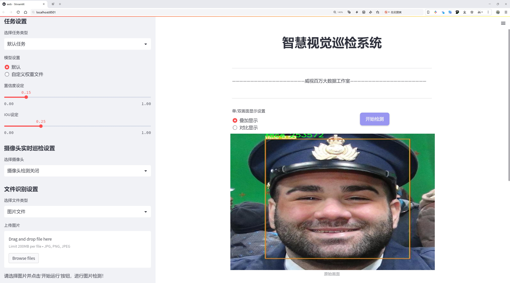
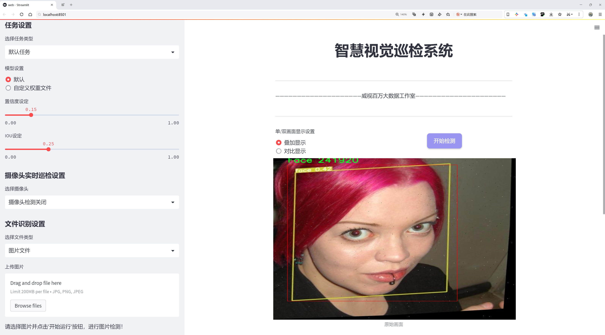
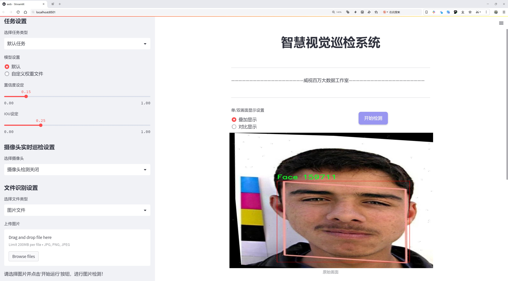
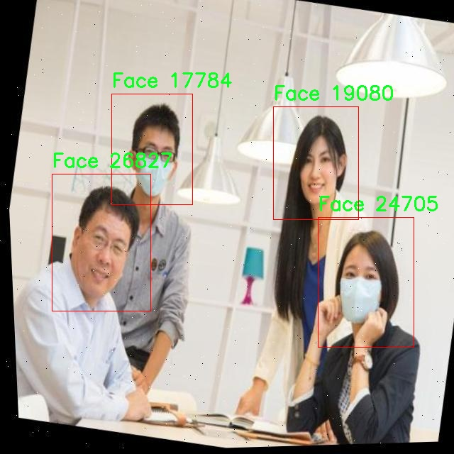
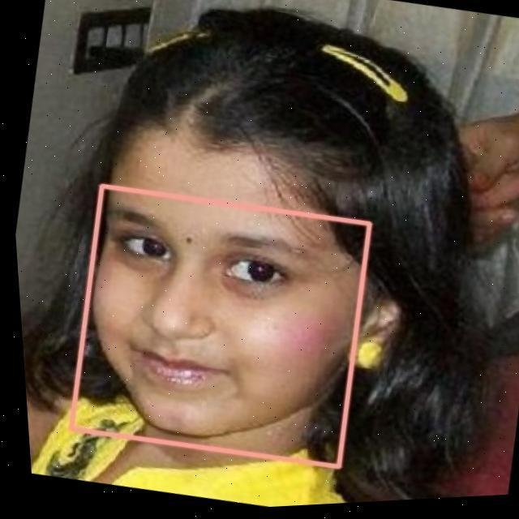
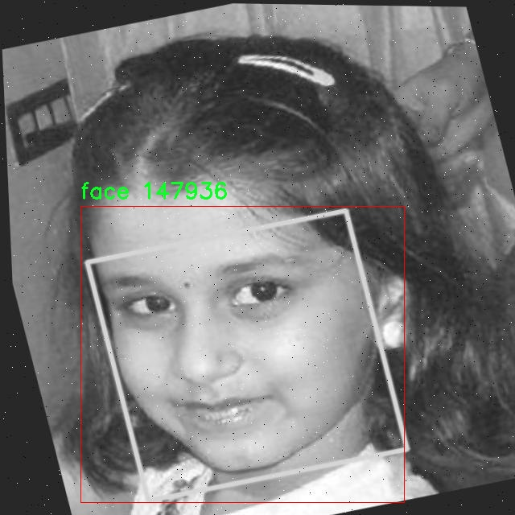
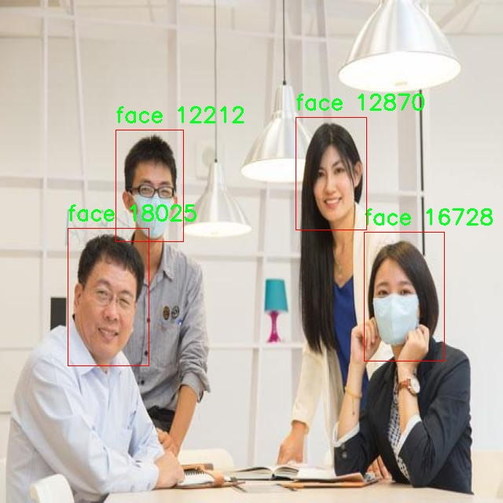
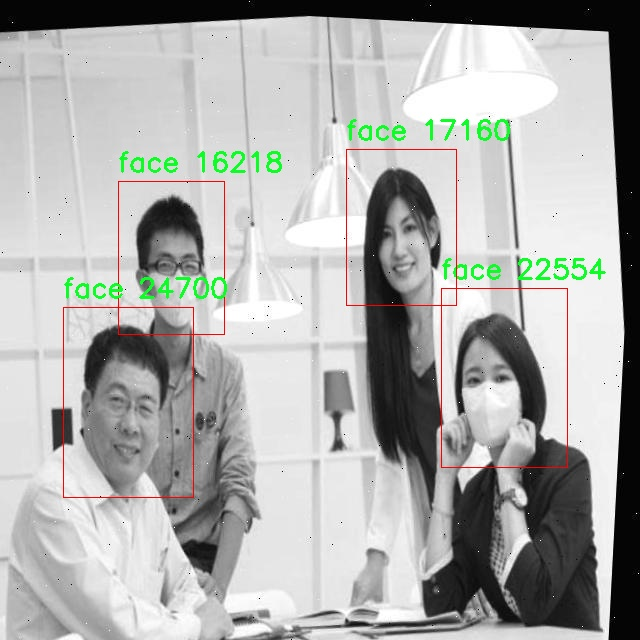

# 人脸检测检测系统源码分享
 # [一条龙教学YOLOV8标注好的数据集一键训练_70+全套改进创新点发刊_Web前端展示]

### 1.研究背景与意义

项目参考[AAAI Association for the Advancement of Artificial Intelligence](https://gitee.com/qunmasj/projects)

研究背景与意义

随着人工智能技术的迅猛发展，计算机视觉领域的研究日益受到关注，尤其是人脸检测技术在安全监控、智能家居、社交媒体等多个应用场景中发挥着越来越重要的作用。人脸检测作为计算机视觉中的一个关键任务，旨在从图像或视频中自动识别和定位人脸。近年来，深度学习方法的引入极大地推动了人脸检测技术的进步，尤其是基于卷积神经网络（CNN）的目标检测算法，如YOLO（You Only Look Once）系列模型，因其高效性和实时性而备受青睐。

YOLOv8作为YOLO系列的最新版本，具有更高的检测精度和更快的推理速度，能够在复杂场景中有效识别目标。然而，尽管YOLOv8在多个数据集上表现出色，但在特定应用场景下，尤其是面对多样化的人脸姿态、表情变化和光照条件时，仍然存在一定的局限性。因此，针对YOLOv8进行改进，以提升其在人脸检测任务中的性能，具有重要的理论价值和实际意义。

本研究所采用的数据集包含5007张人脸图像，专注于单一类别——人脸。这一数据集的规模和多样性为模型的训练和评估提供了良好的基础。通过对该数据集的深入分析，可以识别出人脸检测中的潜在挑战，如不同年龄、性别、种族的人脸特征差异，以及在不同环境下（如光照、遮挡等）的人脸识别难度。这些因素都可能影响YOLOv8的检测效果，因此，在模型改进过程中，需充分考虑这些变量，以提高模型的鲁棒性和适应性。

在技术层面，本研究将结合YOLOv8的最新架构，探索改进策略，包括但不限于网络结构的优化、数据增强技术的应用以及后处理算法的改进。通过引入新的损失函数和训练策略，旨在提升模型对人脸特征的敏感性，从而提高检测精度。此外，研究还将考虑如何在保证实时性的前提下，进一步降低模型的计算复杂度，以适应边缘计算和移动设备的应用需求。

从应用角度来看，改进后的YOLOv8人脸检测系统将为各类智能应用提供强有力的技术支持。在安全监控领域，系统能够实时识别潜在威胁，提升公共安全；在社交媒体平台，能够实现更精准的用户画像和内容推荐；在智能家居中，能够实现个性化的用户交互体验。这些应用不仅能够提升用户体验，还将推动相关产业的发展，具有广泛的市场前景。

综上所述，基于改进YOLOv8的人脸检测系统的研究，不仅在理论上丰富了计算机视觉和深度学习的研究内容，也在实践中为人脸检测技术的应用提供了新的思路和解决方案。通过对人脸检测技术的深入探讨和改进，期望能够为未来的智能化社会贡献一份力量。

### 2.图片演示







##### 注意：由于此博客编辑较早，上面“2.图片演示”和“3.视频演示”展示的系统图片或者视频可能为老版本，新版本在老版本的基础上升级如下：（实际效果以升级的新版本为准）

  （1）适配了YOLOV8的“目标检测”模型和“实例分割”模型，通过加载相应的权重（.pt）文件即可自适应加载模型。

  （2）支持“图片识别”、“视频识别”、“摄像头实时识别”三种识别模式。

  （3）支持“图片识别”、“视频识别”、“摄像头实时识别”三种识别结果保存导出，解决手动导出（容易卡顿出现爆内存）存在的问题，识别完自动保存结果并导出到。

  （4）支持Web前端系统中的标题、背景图等自定义修改，后面提供修改教程。

  另外本项目提供训练的数据集和训练教程,暂不提供权重文件（best.pt）,需要您按照教程进行训练后实现图片演示和Web前端界面演示的效果。

### 3.视频演示

[3.1 视频演示](https://www.bilibili.com/video/BV1XmWresE7u/?vd_source=ff015de2d29cbe2a9cdbfa7064407a08)

### 4.数据集信息展示

数据集信息展示

在现代计算机视觉领域，人脸检测作为一个重要的研究方向，受到了广泛的关注。为了提升人脸检测系统的性能，尤其是在复杂环境下的准确性和鲁棒性，构建高质量的数据集显得尤为重要。本数据集名为“face-detection”，专门用于训练和改进YOLOv8模型，旨在为研究人员和开发者提供一个丰富的资源，以推动人脸检测技术的发展。

该数据集包含5007张图像，所有图像均为高质量的面部图像，确保了在训练过程中模型能够学习到丰富的特征。这些图像涵盖了多种场景和光照条件，确保了模型在不同环境下的适应性和准确性。尽管数据集中仅包含一个类别，即“Face”，但通过多样化的图像内容，模型能够更好地理解和识别面部特征。这种专注于单一类别的设计，能够使得模型在该领域的检测精度达到更高的水平。

在数据集的构建过程中，图像的选择和标注都经过严格的筛选和审核，确保每一张图像都符合人脸检测的标准。所有图像均遵循CC BY 4.0许可证，这意味着用户可以自由使用、修改和分发数据集，只需适当引用原作者即可。这种开放的许可方式不仅促进了学术交流，也为开发者提供了灵活的使用空间，鼓励他们在此基础上进行创新和改进。

数据集的使用不仅限于YOLOv8模型的训练，还可以为其他人脸检测算法的开发提供基础。通过对该数据集的深入分析，研究人员可以探索不同的特征提取方法和检测策略，从而推动人脸检测技术的进一步发展。此外，数据集的多样性和丰富性使得它成为评估新算法性能的理想选择，能够帮助研究人员更好地理解模型在实际应用中的表现。

在未来的研究中，随着人脸检测技术的不断进步，数据集的更新和扩展也将成为一个重要的方向。我们鼓励用户在使用数据集的过程中，积极反馈和分享他们的研究成果和经验，以便于不断完善和丰富该数据集。通过集体的努力，我们相信可以进一步推动人脸检测技术的进步，为智能监控、身份验证、社交媒体等领域的应用提供更为强大的支持。

总之，本数据集为人脸检测研究提供了一个坚实的基础，涵盖了丰富的图像资源和高质量的标注信息。希望通过本数据集的使用，能够激发更多的研究灵感，推动人脸检测技术的创新与发展。











### 5.全套项目环境部署视频教程（零基础手把手教学）

[5.1 环境部署教程链接（零基础手把手教学）](https://www.ixigua.com/7404473917358506534?logTag=c807d0cbc21c0ef59de5)


[5.2 安装Python虚拟环境创建和依赖库安装视频教程链接（零基础手把手教学）](https://www.ixigua.com/7404474678003106304?logTag=1f1041108cd1f708b01a)

### 6.手把手YOLOV8训练视频教程（零基础小白有手就能学会）

[6.1 环境部署教程链接（零基础手把手教学）](https://www.ixigua.com/7404477157818401292?logTag=d31a2dfd1983c9668658)

### 7.70+种全套YOLOV8创新点代码加载调参视频教程（一键加载写好的改进模型的配置文件）

[7.1 环境部署教程链接（零基础手把手教学）](https://www.ixigua.com/7404478314661806627?logTag=29066f8288e3f4eea3a4)

### 8.70+种全套YOLOV8创新点原理讲解（非科班也可以轻松写刊发刊，V10版本正在科研待更新）

由于篇幅限制，每个创新点的具体原理讲解就不一一展开，具体见下列网址中的创新点对应子项目的技术原理博客网址【Blog】：


[8.1 70+种全套YOLOV8创新点原理讲解链接](https://gitee.com/qunmasj/good)

### 9.系统功能展示（检测对象为举例，实际内容以本项目数据集为准）

图1.系统支持检测结果表格显示

  图2.系统支持置信度和IOU阈值手动调节

  图3.系统支持自定义加载权重文件best.pt(需要你通过步骤5中训练获得)

  图4.系统支持摄像头实时识别

  图5.系统支持图片识别

  图6.系统支持视频识别

  图7.系统支持识别结果文件自动保存

  图8.系统支持Excel导出检测结果数据


### 10.原始YOLOV8算法原理

原始YOLOv8算法原理

YOLOv8作为YOLO系列目标检测算法的最新版本，承载着前几代模型的创新与改进，旨在通过高效的检测机制和优化的网络结构，实现更快的检测速度和更高的检测精度。YOLO系列自诞生以来，一直以其单阶段检测的特点受到广泛关注，而YOLOv8在这一基础上进一步提升了模型的性能，尤其是在处理复杂场景和多尺度目标时的表现。

YOLOv8的网络结构可以分为四个主要部分：输入层、Backbone骨干网络、Neck特征融合网络和Head检测模块。输入层负责对输入图像进行预处理，包括图像的缩放、Mosaic增强以及自适应锚框计算等操作。这些预处理步骤不仅提高了模型对不同输入图像的适应能力，还增强了模型的鲁棒性，使其能够在多样化的环境中保持高效的检测性能。

在Backbone部分，YOLOv8采用了C2f模块替代了之前版本中的C3模块。C2f模块通过更丰富的分支和跨层连接，增强了特征的梯度流动，提升了特征提取的能力。这一改进使得YOLOv8能够更好地捕捉到图像中的细节信息，从而在目标检测中获得更为准确的特征表示。此外，YOLOv8还通过SPPF（Spatial Pyramid Pooling Fusion）模块对输出特征图进行处理，利用不同内核尺寸的池化操作合并特征图，进一步丰富了特征信息，为后续的特征融合奠定了基础。

Neck部分采用了双塔结构，将特征金字塔网络（FPN）与路径聚合网络（PAN）相结合。这种设计有效促进了语义特征与定位特征之间的转移，使得网络在处理不同尺度目标时能够更为灵活。通过这种特征融合机制，YOLOv8不仅提升了对小目标的检测能力，还增强了对大目标的识别精度，进一步提升了整体的检测性能。

在Head检测模块中，YOLOv8引入了解耦头的结构，将分类和回归任务分离开来。传统的目标检测方法通常将这两个任务耦合在一起，导致模型在复杂场景下可能出现定位不准或分类错误的问题。而通过解耦设计，YOLOv8能够使每个任务更加专注，从而提高了模型的整体表现。此外，YOLOv8采用了Anchor-Free的目标检测方法，摒弃了传统的锚框预测机制，直接通过回归方式预测目标的位置和大小。这一创新不仅简化了模型的设计，还加速了非最大抑制（NMS）过程，提高了检测效率。

YOLOv8的训练过程同样经过了精心设计，采用了Task-Aligned Assigner策略进行正负样本的分配。这一策略根据分类与回归的分数加权结果选择正样本，从而提高了模型的训练效果。在损失计算方面，YOLOv8结合了二元交叉熵损失（BCELoss）和分布焦点损失（DFLoss）、完全交并比损失（CIOULoss），使得模型在边界框预测上更加精准。这些改进使得YOLOv8在训练时间和检测精度上均有显著提升，能够更好地满足实时检测的需求。

相较于前几代YOLO模型，YOLOv8在多个方面实现了优化。首先，在模型结构上，YOLOv8通过引入C2f模块和解耦头结构，提升了特征提取和任务处理的效率。其次，YOLOv8在特征融合上采用了更为先进的双塔结构，增强了对不同尺度目标的检测能力。此外，YOLOv8的Anchor-Free设计简化了目标检测的流程，使得模型在处理复杂场景时表现得更加灵活。

总的来说，YOLOv8不仅在检测精度和速度上实现了突破，还在模型的轻量化和实时性方面做出了显著贡献。其独特的网络结构和创新的算法设计，使得YOLOv8成为当前目标检测领域的一项重要进展，能够广泛应用于智能监控、自动驾驶、无人机巡检等多个场景，推动了计算机视觉技术的进一步发展。通过对YOLOv8的深入研究与应用，未来的目标检测任务将更加高效、准确，为各行各业的智能化转型提供强有力的技术支持。


### 11.项目核心源码讲解（再也不用担心看不懂代码逻辑）

#### 11.1 ui.py

以下是对代码的核心部分进行保留和详细注释的版本：

```python
import sys
import subprocess

def run_script(script_path):
    """
    使用当前 Python 环境运行指定的脚本。

    Args:
        script_path (str): 要运行的脚本路径

    Returns:
        None
    """
    # 获取当前 Python 解释器的路径
    python_path = sys.executable

    # 构建运行命令，使用 streamlit 运行指定的脚本
    command = f'"{python_path}" -m streamlit run "{script_path}"'

    # 执行命令并等待其完成
    result = subprocess.run(command, shell=True)
    
    # 检查命令执行的返回码，如果不为0，表示执行出错
    if result.returncode != 0:
        print("脚本运行出错。")

# 实例化并运行应用
if __name__ == "__main__":
    # 指定要运行的脚本路径
    script_path = "web.py"  # 假设脚本在当前目录下

    # 调用函数运行脚本
    run_script(script_path)
```

### 代码核心部分说明：
1. **导入模块**：
   - `sys`：用于获取当前 Python 解释器的路径。
   - `subprocess`：用于执行外部命令。

2. **`run_script` 函数**：
   - 功能：接受一个脚本路径作为参数，并使用当前 Python 环境运行该脚本。
   - 过程：
     - 获取当前 Python 解释器的路径。
     - 构建运行命令，使用 `streamlit` 运行指定的脚本。
     - 使用 `subprocess.run` 执行命令，并等待其完成。
     - 检查命令的返回码，若不为0，则输出错误信息。

3. **主程序部分**：
   - 当脚本作为主程序运行时，指定要运行的脚本路径（此处假设为 `web.py`）。
   - 调用 `run_script` 函数来执行该脚本。

这个程序文件名为 `ui.py`，其主要功能是通过当前的 Python 环境来运行一个指定的脚本，具体是使用 Streamlit 框架来启动一个 Web 应用。

首先，文件导入了几个必要的模块，包括 `sys`、`os` 和 `subprocess`。其中，`sys` 模块用于访问与 Python 解释器相关的变量和函数，`os` 模块提供了与操作系统交互的功能，而 `subprocess` 模块则用于生成新的进程、连接到它们的输入/输出/错误管道，并获取它们的返回码。

接下来，程序定义了一个名为 `run_script` 的函数，该函数接受一个参数 `script_path`，表示要运行的脚本的路径。在函数内部，首先获取当前 Python 解释器的路径，这通过 `sys.executable` 实现。然后，构建一个命令字符串，该命令使用当前的 Python 解释器和 Streamlit 模块来运行指定的脚本。命令的格式为 `"{python_path}" -m streamlit run "{script_path}"`，其中 `{python_path}` 和 `{script_path}` 会被实际的路径替换。

随后，使用 `subprocess.run` 方法执行构建好的命令。该方法的 `shell=True` 参数允许在 shell 中执行命令。执行完命令后，程序检查返回码，如果返回码不为 0，表示脚本运行出错，则打印出错信息。

在文件的最后部分，使用 `if __name__ == "__main__":` 来确保当该文件作为主程序运行时才会执行以下代码。这里指定了要运行的脚本路径为 `web.py`，并调用 `run_script` 函数来启动这个脚本。

总的来说，这个文件的作用是提供一个简单的接口来运行一个 Streamlit 应用，方便用户通过命令行启动 Web 应用。

#### 11.2 ultralytics\utils\autobatch.py

以下是代码中最核心的部分，并附上详细的中文注释：

```python
import numpy as np
import torch
from ultralytics.utils import LOGGER, colorstr
from ultralytics.utils.torch_utils import profile

def autobatch(model, imgsz=640, fraction=0.60, batch_size=16):
    """
    自动估计最佳的YOLO批处理大小，以使用可用CUDA内存的一部分。

    参数:
        model (torch.nn.Module): 要计算批处理大小的YOLO模型。
        imgsz (int, optional): 用作YOLO模型输入的图像大小。默认为640。
        fraction (float, optional): 要使用的可用CUDA内存的比例。默认为0.60。
        batch_size (int, optional): 如果检测到错误时使用的默认批处理大小。默认为16。

    返回:
        (int): 最优批处理大小。
    """

    # 检查设备
    prefix = colorstr("AutoBatch: ")
    LOGGER.info(f"{prefix}计算图像大小为 {imgsz} 的最优批处理大小")
    device = next(model.parameters()).device  # 获取模型所在设备
    if device.type == "cpu":
        LOGGER.info(f"{prefix}未检测到CUDA，使用默认CPU批处理大小 {batch_size}")
        return batch_size
    if torch.backends.cudnn.benchmark:
        LOGGER.info(f"{prefix} ⚠️ 需要 torch.backends.cudnn.benchmark=False，使用默认批处理大小 {batch_size}")
        return batch_size

    # 检查CUDA内存
    gb = 1 << 30  # 字节转换为GiB (1024 ** 3)
    properties = torch.cuda.get_device_properties(device)  # 获取设备属性
    t = properties.total_memory / gb  # GiB总内存
    r = torch.cuda.memory_reserved(device) / gb  # GiB已保留内存
    a = torch.cuda.memory_allocated(device) / gb  # GiB已分配内存
    f = t - (r + a)  # GiB可用内存
    LOGGER.info(f"{prefix}{device} ({properties.name}) {t:.2f}G 总内存, {r:.2f}G 已保留, {a:.2f}G 已分配, {f:.2f}G 可用")

    # 评估批处理大小
    batch_sizes = [1, 2, 4, 8, 16]  # 测试的批处理大小
    try:
        img = [torch.empty(b, 3, imgsz, imgsz) for b in batch_sizes]  # 创建空图像张量
        results = profile(img, model, n=3, device=device)  # 评估不同批处理大小的性能

        # 拟合解决方案
        y = [x[2] for x in results if x]  # 提取内存使用情况
        p = np.polyfit(batch_sizes[: len(y)], y, deg=1)  # 一次多项式拟合
        b = int((f * fraction - p[1]) / p[0])  # 计算最优批处理大小
        if None in results:  # 如果某些大小失败
            i = results.index(None)  # 找到第一个失败的索引
            if b >= batch_sizes[i]:  # 如果最优批处理大小超过失败点
                b = batch_sizes[max(i - 1, 0)]  # 选择安全的前一个点
        if b < 1 or b > 1024:  # 如果批处理大小超出安全范围
            b = batch_size
            LOGGER.info(f"{prefix}警告 ⚠️ 检测到CUDA异常，使用默认批处理大小 {batch_size}.")

        fraction = (np.polyval(p, b) + r + a) / t  # 预测的实际内存使用比例
        LOGGER.info(f"{prefix}使用批处理大小 {b}，在 {device} 上 {t * fraction:.2f}G/{t:.2f}G ({fraction * 100:.0f}%) ✅")
        return b
    except Exception as e:
        LOGGER.warning(f"{prefix}警告 ⚠️ 检测到错误: {e}, 使用默认批处理大小 {batch_size}.")
        return batch_size
```

### 代码说明：
1. **导入必要的库**：导入了 `numpy` 和 `torch`，以及一些来自 `ultralytics` 的工具函数和日志记录器。
2. **`autobatch` 函数**：该函数的主要功能是自动估计最佳的批处理大小，以便在训练YOLO模型时有效利用CUDA内存。
3. **设备检查**：首先检查模型所在的设备类型，如果是CPU，则返回默认的批处理大小。如果CUDA未启用或不适合，则也返回默认大小。
4. **CUDA内存检查**：获取设备的总内存、已保留内存和已分配内存，并计算可用内存。
5. **批处理大小评估**：通过创建不同批处理大小的空张量并使用 `profile` 函数评估它们的性能，拟合出一个线性模型来预测最佳批处理大小。
6. **异常处理**：在出现错误时，记录警告并返回默认的批处理大小。

这个程序文件 `ultralytics/utils/autobatch.py` 的主要功能是自动估算在使用 PyTorch 进行 YOLO 模型训练时，最佳的批处理大小（batch size），以便有效利用可用的 CUDA 内存。

文件中首先导入了一些必要的库，包括 `deepcopy`、`numpy` 和 `torch`，以及一些来自 `ultralytics.utils` 的工具和配置。接着定义了两个主要的函数：`check_train_batch_size` 和 `autobatch`。

`check_train_batch_size` 函数的作用是检查给定 YOLO 模型的训练批处理大小。它接受三个参数：模型、图像大小（默认为 640）和一个布尔值 `amp`，用于指示是否使用自动混合精度（AMP）。在函数内部，使用 `torch.cuda.amp.autocast` 来启用自动混合精度，然后调用 `autobatch` 函数来计算最佳的批处理大小，并返回这个值。

`autobatch` 函数则是核心功能的实现。它接受多个参数，包括模型、图像大小、使用的 CUDA 内存比例（默认为 60%）和默认的批处理大小（默认为 16）。函数首先检查模型所在的设备，如果设备是 CPU，则直接返回默认的批处理大小。如果使用了 `torch.backends.cudnn.benchmark`，则也会返回默认的批处理大小。

接下来，函数会检查 CUDA 内存的使用情况，包括总内存、已保留内存和已分配内存，并计算出可用的空闲内存。然后，定义了一组可能的批处理大小（1、2、4、8、16），并为每个批处理大小创建一个空的张量，以便进行性能分析。

通过调用 `profile` 函数，函数会对不同的批处理大小进行性能测试，并收集内存使用情况。然后，使用一阶多项式拟合（线性回归）来估算最佳的批处理大小。如果在测试过程中某些批处理大小失败，函数会根据失败的情况调整返回的批处理大小，确保返回的值在安全范围内（1 到 1024 之间）。

最后，函数会记录所使用的批处理大小以及实际的内存使用比例。如果在执行过程中出现异常，函数会捕获并记录警告，返回默认的批处理大小。

总体来说，这个文件的目的是为了帮助用户在训练 YOLO 模型时，自动计算出一个合适的批处理大小，以便更好地利用 GPU 的内存资源，从而提高训练效率。

#### 11.3 ultralytics\models\fastsam\prompt.py

以下是经过简化和注释的核心代码部分，主要集中在 `FastSAMPrompt` 类的功能实现上。

```python
import os
import numpy as np
import torch
from PIL import Image
import cv2
from ultralytics.utils import TQDM

class FastSAMPrompt:
    """
    Fast Segment Anything Model 类，用于图像标注和可视化。

    属性:
        device (str): 计算设备（'cuda' 或 'cpu'）。
        results: 目标检测或分割结果。
        source: 源图像或图像路径。
        clip: 用于线性分配的 CLIP 模型。
    """

    def __init__(self, source, results, device="cuda") -> None:
        """初始化 FastSAMPrompt，设置源图像、结果和设备，并导入 CLIP 模型。"""
        self.device = device
        self.results = results
        self.source = source

        # 导入并赋值 CLIP 模型
        try:
            import clip  # 用于线性分配
        except ImportError:
            from ultralytics.utils.checks import check_requirements
            check_requirements("git+https://github.com/openai/CLIP.git")
            import clip
        self.clip = clip

    @staticmethod
    def _segment_image(image, bbox):
        """根据提供的边界框坐标对图像进行分割。"""
        image_array = np.array(image)
        segmented_image_array = np.zeros_like(image_array)  # 创建与原图同样大小的全黑图像
        x1, y1, x2, y2 = bbox
        segmented_image_array[y1:y2, x1:x2] = image_array[y1:y2, x1:x2]  # 在指定区域填充原图像素
        segmented_image = Image.fromarray(segmented_image_array)
        black_image = Image.new("RGB", image.size, (255, 255, 255))  # 创建白色背景图像
        transparency_mask = np.zeros((image_array.shape[0], image_array.shape[1]), dtype=np.uint8)  # 创建透明度掩码
        transparency_mask[y1:y2, x1:x2] = 255  # 在分割区域设置为255（不透明）
        transparency_mask_image = Image.fromarray(transparency_mask, mode="L")
        black_image.paste(segmented_image, mask=transparency_mask_image)  # 将分割图像粘贴到白色背景上
        return black_image

    @staticmethod
    def _format_results(result, filter=0):
        """将检测结果格式化为包含 ID、分割、边界框、得分和面积的注释列表。"""
        annotations = []
        n = len(result.masks.data) if result.masks is not None else 0
        for i in range(n):
            mask = result.masks.data[i] == 1.0  # 获取分割掩码
            if torch.sum(mask) >= filter:  # 根据过滤条件筛选掩码
                annotation = {
                    "id": i,
                    "segmentation": mask.cpu().numpy(),
                    "bbox": result.boxes.data[i],
                    "score": result.boxes.conf[i],
                }
                annotation["area"] = annotation["segmentation"].sum()  # 计算面积
                annotations.append(annotation)
        return annotations

    def plot(self, annotations, output):
        """
        在图像上绘制注释、边界框和点，并保存输出。

        参数:
            annotations (list): 要绘制的注释。
            output (str): 保存绘图的输出目录。
        """
        pbar = TQDM(annotations, total=len(annotations))  # 创建进度条
        for ann in pbar:
            result_name = os.path.basename(ann.path)
            image = ann.orig_img[..., ::-1]  # BGR 转 RGB
            original_h, original_w = ann.orig_shape
            plt.figure(figsize=(original_w / 100, original_h / 100))  # 设置图像大小
            plt.imshow(image)

            if ann.masks is not None:
                masks = ann.masks.data
                for i, mask in enumerate(masks):
                    mask = cv2.morphologyEx(mask.astype(np.uint8), cv2.MORPH_CLOSE, np.ones((3, 3), np.uint8))  # 闭运算
                    masks[i] = cv2.morphologyEx(mask.astype(np.uint8), cv2.MORPH_OPEN, np.ones((8, 8), np.uint8))  # 开运算

                self.fast_show_mask(masks, plt.gca())  # 显示掩码

            # 保存图像
            save_path = os.path.join(output, result_name)
            plt.axis("off")
            plt.savefig(save_path, bbox_inches="tight", pad_inches=0, transparent=True)
            plt.close()
            pbar.set_description(f"Saving {result_name} to {save_path}")

    @torch.no_grad()
    def retrieve(self, model, preprocess, elements, search_text: str, device) -> int:
        """处理图像和文本，计算相似度并返回 softmax 分数。"""
        preprocessed_images = [preprocess(image).to(device) for image in elements]
        tokenized_text = self.clip.tokenize([search_text]).to(device)
        stacked_images = torch.stack(preprocessed_images)
        image_features = model.encode_image(stacked_images)
        text_features = model.encode_text(tokenized_text)
        image_features /= image_features.norm(dim=-1, keepdim=True)
        text_features /= text_features.norm(dim=-1, keepdim=True)
        probs = 100.0 * image_features @ text_features.T  # 计算相似度
        return probs[:, 0].softmax(dim=0)  # 返回 softmax 概率

    def everything_prompt(self):
        """返回处理后的结果。"""
        return self.results
```

### 代码注释说明：
1. **类的定义**：`FastSAMPrompt` 类用于处理图像分割和标注，包含了初始化、图像分割、结果格式化、绘图和检索等功能。
2. **初始化方法**：在初始化时设置设备类型、源图像和结果，并导入 CLIP 模型。
3. **图像分割**：`_segment_image` 方法根据边界框对图像进行分割，返回带有透明区域的图像。
4. **结果格式化**：`_format_results` 方法将检测结果转换为包含多个信息的字典列表。
5. **绘图方法**：`plot` 方法用于在图像上绘制分割结果，并保存为文件。
6. **检索方法**：`retrieve` 方法处理图像和文本，计算它们之间的相似度并返回概率分布。
7. **结果返回**：`everything_prompt` 方法用于返回处理后的结果。

通过这些注释，可以更好地理解代码的结构和功能。

这个程序文件定义了一个名为 `FastSAMPrompt` 的类，主要用于图像注释和可视化，结合了快速分割模型（Fast Segment Anything Model）和 CLIP 模型。类的初始化方法接收源图像、检测结果和计算设备（如 CUDA 或 CPU），并尝试导入 CLIP 模型以进行线性分配。

类中包含多个静态方法和实例方法。静态方法 `_segment_image` 用于根据给定的边界框坐标对图像进行分割，生成透明的分割图像。`_format_results` 方法将检测结果格式化为包含 ID、分割、边界框、置信度和面积的注释列表。`_get_bbox_from_mask` 方法则通过对掩码应用形态学变换来获取边界框。

`plot` 方法用于在图像上绘制注释、边界框和点，并将结果保存到指定的输出目录。它使用 `TQDM` 库来显示进度条，处理每个注释并使用 `matplotlib` 绘制图像。方法中还可以选择是否使用随机颜色绘制掩码、是否应用形态学变换以提高掩码质量，以及是否绘制轮廓。

`fast_show_mask` 方法快速显示掩码注释，支持绘制边界框和点。`retrieve` 方法处理图像和文本，计算相似度并返回 softmax 分数。`_crop_image` 方法根据提供的注释格式裁剪图像，返回裁剪后的图像和相关数据。

类中还定义了 `box_prompt`、`point_prompt` 和 `text_prompt` 方法，分别用于根据边界框、点和文本提示调整掩码。`everything_prompt` 方法则返回处理后的结果。

整体来看，这个类提供了一系列功能，旨在通过快速分割模型和 CLIP 模型结合，实现对图像的高效注释和可视化，适用于计算机视觉任务中的目标检测和分割。

#### 11.4 train.py

以下是代码中最核心的部分，并附上详细的中文注释：

```python
import os
import torch
import yaml
from ultralytics import YOLO  # 导入YOLO模型库
from QtFusion.path import abs_path  # 导入路径处理函数

# 确定使用的设备，如果有可用的GPU则使用GPU，否则使用CPU
device = "0" if torch.cuda.is_available() else "cpu"

if __name__ == '__main__':  # 确保该模块被直接运行时才执行以下代码
    workers = 1  # 设置数据加载的工作进程数
    batch = 2  # 设置每个批次的大小

    data_name = "data"  # 数据集名称
    # 获取数据集yaml文件的绝对路径
    data_path = abs_path(f'datasets/{data_name}/{data_name}.yaml', path_type='current')  
    unix_style_path = data_path.replace(os.sep, '/')  # 将路径转换为Unix风格

    # 获取数据集目录路径
    directory_path = os.path.dirname(unix_style_path)
    
    # 读取YAML文件，保持原有顺序
    with open(data_path, 'r') as file:
        data = yaml.load(file, Loader=yaml.FullLoader)
    
    # 如果YAML文件中有'path'项，则修改为当前目录路径
    if 'path' in data:
        data['path'] = directory_path
        # 将修改后的数据写回YAML文件
        with open(data_path, 'w') as file:
            yaml.safe_dump(data, file, sort_keys=False)

    # 加载预训练的YOLOv8模型
    model = YOLO(model='./ultralytics/cfg/models/v8/yolov8s.yaml', task='detect')  
    
    # 开始训练模型
    results2 = model.train(  
        data=data_path,  # 指定训练数据的配置文件路径
        device=device,  # 指定使用的设备
        workers=workers,  # 指定使用的工作进程数
        imgsz=640,  # 指定输入图像的大小为640x640
        epochs=100,  # 指定训练的轮数为100
        batch=batch,  # 指定每个批次的大小
        name='train_v8_' + data_name  # 指定训练任务的名称
    )
```

### 代码注释说明：
1. **导入库**：导入必要的库，包括操作系统处理、PyTorch、YAML文件处理和YOLO模型。
2. **设备选择**：通过`torch.cuda.is_available()`判断是否有可用的GPU，选择合适的设备进行训练。
3. **数据集路径处理**：根据数据集名称构建YAML文件的路径，并将其转换为Unix风格的路径。
4. **读取和修改YAML文件**：读取数据集的配置文件，修改其中的`path`项为当前目录路径，并将修改后的内容写回文件。
5. **模型加载**：加载YOLOv8的预训练模型配置。
6. **模型训练**：调用`model.train()`方法开始训练，传入必要的参数，包括数据路径、设备、工作进程数、图像大小、训练轮数和批次大小等。

这个程序文件 `train.py` 是一个用于训练 YOLOv8 模型的脚本。首先，它导入了必要的库，包括 `os`、`torch`、`yaml` 和 `ultralytics` 中的 YOLO 模型。程序会检查是否有可用的 GPU，如果有，则使用 GPU 进行训练，否则使用 CPU。

在 `__main__` 块中，程序设置了一些训练参数，包括工作进程数和批次大小。接着，定义了数据集的名称为 "data"，并构建了该数据集 YAML 文件的绝对路径。使用 `abs_path` 函数将相对路径转换为绝对路径，并将路径中的分隔符统一为 Unix 风格。

程序随后获取数据集的目录路径，并打开指定的 YAML 文件以读取数据。它使用 `yaml` 库加载 YAML 文件内容，并检查其中是否包含 `path` 项。如果存在，程序会将其更新为数据集的目录路径，并将修改后的内容写回 YAML 文件，以确保后续训练能够正确找到数据集。

接下来，程序加载预训练的 YOLOv8 模型，指定模型配置文件的路径。然后，它调用 `model.train()` 方法开始训练模型。在训练过程中，程序指定了多个参数，包括数据配置文件的路径、设备类型、工作进程数、输入图像的大小（640x640）、训练的 epoch 数（100）以及每个批次的大小（2）。最后，训练任务的名称被设置为 `'train_v8_'` 加上数据集的名称。

整个程序的流程是为了方便用户在指定的数据集上进行 YOLOv8 模型的训练，并且通过 YAML 文件的处理确保数据路径的正确性。

#### 11.5 web.py

以下是代码中最核心的部分，并附上详细的中文注释：

```python
import cv2
import numpy as np
from PIL import ImageFont, ImageDraw, Image

def draw_with_chinese(image, text, position, font_size=20, color=(255, 0, 0)):
    """
    在OpenCV图像上绘制中文文字
    """
    # 将图像从 OpenCV 格式（BGR）转换为 PIL 格式（RGB）
    image_pil = Image.fromarray(cv2.cvtColor(image, cv2.COLOR_BGR2RGB))
    draw = ImageDraw.Draw(image_pil)
    # 使用指定的字体
    font = ImageFont.truetype("simsun.ttc", font_size, encoding="unic")
    draw.text(position, text, font=font, fill=color)
    # 将图像从 PIL 格式（RGB）转换回 OpenCV 格式（BGR）
    return cv2.cvtColor(np.array(image_pil), cv2.COLOR_RGB2BGR)

def adjust_parameter(image_size, base_size=1000):
    """
    计算自适应参数，基于图片的最大尺寸
    """
    max_size = max(image_size)
    return max_size / base_size

def draw_detections(image, info, alpha=0.2):
    """
    在图像上绘制检测结果，包括边界框和标签
    """
    name, bbox, conf, cls_id, mask = info['class_name'], info['bbox'], info['score'], info['class_id'], info['mask']
    adjust_param = adjust_parameter(image.shape[:2])  # 获取自适应参数
    if mask is None:
        # 当 mask 为 None，计算 bbox 的矩形框面积
        x1, y1, x2, y2 = bbox
        aim_frame_area = (x2 - x1) * (y2 - y1)

        # 绘制矩形框
        cv2.rectangle(image, (x1, y1), (x2, y2), color=(0, 0, 255), thickness=int(3*adjust_param))

        # 绘制标签和面积
        label_area = f"{name} {int(aim_frame_area)}"
        image = draw_with_chinese(image, label_area, (x1, y1 - int(30 * adjust_param)), font_size=int(35*adjust_param))

    else:
        # 当 mask 不为 None，计算点集围成的多边形面积
        mask_points = np.concatenate(mask)  # 假设 mask 是一个列表，内含一个 numpy 数组
        aim_frame_area = calculate_polygon_area(mask_points)
        try:
            # 绘制mask的轮廓
            cv2.drawContours(image, [mask_points.astype(np.int32)], -1, (0, 0, 255), thickness=int(3*adjust_param))

            # 绘制标签和面积
            label_area = f"{name}  {int(aim_frame_area)}"
            x, y = np.min(mask_points, axis=0).astype(int)
            image = draw_with_chinese(image, label_area, (x, y - int(30 * adjust_param)), font_size=int(35*adjust_param))
        except:
            pass

    return image, aim_frame_area

def calculate_polygon_area(points):
    """
    计算多边形的面积，输入应为一个 Nx2 的numpy数组，表示多边形的顶点坐标
    """
    if len(points) < 3:  # 多边形至少需要3个顶点
        return 0
    return cv2.contourArea(points)

class Detection_UI:
    """
    检测系统类。
    """

    def __init__(self):
        """
        初始化检测系统的参数。
        """
        # 初始化类别标签列表和为每个类别随机分配颜色
        self.cls_name = Label_list
        self.colors = [[random.randint(0, 255) for _ in range(3)] for _ in range(len(self.cls_name))]

        # 初始化检测相关的配置参数
        self.model_type = None
        self.conf_threshold = 0.15  # 默认置信度阈值
        self.iou_threshold = 0.5  # 默认IOU阈值

        # 初始化相机和文件相关的变量
        self.selected_camera = None
        self.file_type = None
        self.uploaded_file = None
        self.uploaded_video = None

        # 初始化检测结果相关的变量
        self.detection_result = None
        self.detection_location = None
        self.detection_confidence = None
        self.detection_time = None

        # 初始化日志数据保存路径
        self.saved_log_data = abs_path("tempDir/log_table_data.csv", path_type="current")

        # 获取可用摄像头列表
        self.available_cameras = get_camera_names()

        # 加载模型实例
        self.model = Web_Detector()  # 创建Detector模型实例
        self.model.load_model(model_path=abs_path("weights/yolov8s.pt", path_type="current"))

    def process_camera_or_file(self):
        """
        处理摄像头或文件输入。

        根据用户选择的输入源（摄像头、图片文件或视频文件），处理并显示检测结果。
        """
        # 如果选择了摄像头输入
        if self.selected_camera != "摄像头检测关闭":
            cap = cv2.VideoCapture(self.selected_camera)  # 使用 OpenCV 捕获摄像头画面

            while cap.isOpened():
                ret, frame = cap.read()
                if ret:
                    image, detInfo, _ = self.frame_process(frame, 'camera')  # 处理每一帧
                    # 显示处理后的图像
                    cv2.imshow("Detection", image)
                    if cv2.waitKey(1) & 0xFF == ord('q'):
                        break
                else:
                    break
            cap.release()
            cv2.destroyAllWindows()

    def frame_process(self, image, file_name):
        """
        处理并预测单个图像帧的内容。

        Args:
            image (numpy.ndarray): 输入的图像。
            file_name (str): 处理的文件名。

        Returns:
            tuple: 处理后的图像，检测信息，选择信息列表。
        """
        pre_img = self.model.preprocess(image)  # 对图像进行预处理
        params = {'conf': self.conf_threshold, 'iou': self.iou_threshold}
        self.model.set_param(params)

        pred = self.model.predict(pre_img)  # 使用模型进行预测
        detInfo = []

        if pred[0] is not None:
            det_info = self.model.postprocess(pred)  # 后处理预测结果
            for info in det_info:
                image, aim_frame_area = draw_detections(image, info)  # 绘制检测结果
                detInfo.append([info['class_name'], info['bbox'], aim_frame_area])

        return image, detInfo, []

# 实例化并运行应用
if __name__ == "__main__":
    app = Detection_UI()
    app.process_camera_or_file()
```

### 代码核心部分解释：
1. **绘制中文文字**：`draw_with_chinese` 函数使用 PIL 库在 OpenCV 图像上绘制中文文本，支持指定字体、大小和颜色。
2. **自适应参数调整**：`adjust_parameter` 函数根据图像的最大尺寸计算自适应参数，以便在绘制边界框时能够根据图像大小进行调整。
3. **绘制检测结果**：`draw_detections` 函数根据检测信息在图像上绘制边界框和标签，支持处理有无掩膜的情况。
4. **多边形面积计算**：`calculate_polygon_area` 函数计算多边形的面积，确保输入点数足够。
5. **检测系统类**：`Detection_UI` 类负责初始化检测系统的参数，处理摄像头或文件输入，并在图像上绘制检测结果。

通过这些核心部分，系统能够实现实时检测并在图像上标注检测结果。

这个程序文件 `web.py` 是一个基于 Streamlit 的图像和视频检测应用，主要用于行人跌倒检测。程序中包含多个功能模块，使用 OpenCV 进行图像处理，并结合深度学习模型进行目标检测。以下是对代码的详细说明。

首先，程序导入了一系列必要的库，包括用于随机数生成、临时文件处理、时间管理、图像处理（OpenCV 和 PIL）、Streamlit（用于构建Web应用）、路径处理、日志记录、模型加载、中文名称列表、CSS样式以及一些工具函数。

接下来，定义了一些辅助函数。`draw_with_chinese` 函数用于在 OpenCV 图像上绘制中文文字，`adjust_parameter` 用于根据图像大小调整参数，`draw_detections` 用于在图像上绘制检测框和标签，`calculate_polygon_area` 用于计算多边形的面积，`format_time` 用于格式化时间，`save_chinese_image` 用于保存带有中文路径的图像文件。

然后，定义了一个 `Detection_UI` 类，作为整个检测系统的核心。类的初始化方法中，设置了一些基本参数，包括类别标签、颜色、页面标题、模型类型、置信度阈值、IOU 阈值、摄像头选择、文件上传等。同时，创建了日志表格和可用摄像头列表，并加载深度学习模型的权重。

`setup_page` 和 `setup_sidebar` 方法用于设置页面和侧边栏的布局，允许用户选择任务类型、模型设置、摄像头和文件类型等。

`process_camera_or_file` 方法是处理输入源的核心逻辑，能够根据用户选择的摄像头或上传的文件进行检测。它使用 OpenCV 捕获摄像头画面或读取上传的视频/图像，并调用 `frame_process` 方法进行处理，最终将检测结果显示在界面上。

`frame_process` 方法负责对输入图像进行预处理、模型预测和后处理，返回处理后的图像和检测信息。检测结果通过 `draw_detections` 函数绘制在图像上，并记录到日志表格中。

`toggle_comboBox` 方法用于处理和显示指定帧的检测结果。`frame_table_process` 方法用于更新检测结果的显示。

最后，`setupMainWindow` 方法是应用的主运行逻辑，设置了显示模式、进度条、结果表格和按钮等界面元素，并处理用户的操作（如开始检测、导出结果等）。

整个程序通过实例化 `Detection_UI` 类并调用 `setupMainWindow` 方法来启动应用。用户可以通过网页界面上传图像或视频，选择摄像头进行实时检测，并查看检测结果和日志记录。

#### 11.6 ultralytics\hub\session.py

以下是经过简化和注释的核心代码部分，主要集中在 `HUBTrainingSession` 类的初始化、模型加载、请求处理和上传功能上：

```python
import threading
import time
from http import HTTPStatus
from pathlib import Path
import requests
from ultralytics.hub.utils import HUB_WEB_ROOT
from ultralytics.utils import LOGGER, SETTINGS, checks

class HUBTrainingSession:
    """
    HUBTrainingSession 类用于管理 Ultralytics HUB YOLO 模型的训练会话。
    包括模型初始化、心跳监测和检查点上传等功能。
    """

    def __init__(self, identifier):
        """
        初始化 HUBTrainingSession，使用提供的模型标识符。

        参数:
            identifier (str): 模型标识符，可以是 URL 字符串或特定格式的模型键。
        """
        from hub_sdk import HUBClient

        # 设置 API 请求的速率限制
        self.rate_limits = {
            "metrics": 3.0,
            "ckpt": 900.0,
            "heartbeat": 300.0,
        }
        self.metrics_queue = {}  # 存储每个 epoch 的指标
        self.timers = {}  # 存储定时器

        # 解析输入的标识符
        api_key, model_id, self.filename = self._parse_identifier(identifier)

        # 获取凭证
        active_key = api_key or SETTINGS.get("api_key")
        credentials = {"api_key": active_key} if active_key else None

        # 初始化 HUBClient
        self.client = HUBClient(credentials)

        # 加载模型
        if model_id:
            self.load_model(model_id)
        else:
            self.model = self.client.model()  # 加载空模型

    def load_model(self, model_id):
        """从 Ultralytics HUB 加载现有模型。"""
        self.model = self.client.model(model_id)
        if not self.model.data:  # 如果模型不存在
            raise ValueError("❌ 指定的 HUB 模型不存在")

        # 设置模型 URL
        self.model_url = f"{HUB_WEB_ROOT}/models/{self.model.id}"

        # 设置训练参数并启动心跳监测
        self._set_train_args()
        self.model.start_heartbeat(self.rate_limits["heartbeat"])
        LOGGER.info(f"查看模型: {self.model_url} 🚀")

    def _parse_identifier(self, identifier):
        """
        解析给定的标识符，提取 API 密钥、模型 ID 和文件名。

        参数:
            identifier (str): 要解析的标识符字符串。

        返回:
            (tuple): 包含 API 密钥、模型 ID 和文件名的元组。
        """
        api_key, model_id, filename = None, None, None

        # 检查标识符是否为 HUB URL
        if identifier.startswith(f"{HUB_WEB_ROOT}/models/"):
            model_id = identifier.split(f"{HUB_WEB_ROOT}/models/")[-1]
        else:
            parts = identifier.split("_")
            if len(parts) == 2 and len(parts[0]) == 42 and len(parts[1]) == 20:
                api_key, model_id = parts
            elif len(parts) == 1 and len(parts[0]) == 20:
                model_id = parts[0]
            elif identifier.endswith(".pt") or identifier.endswith(".yaml"):
                filename = identifier
            else:
                raise ValueError("无法解析模型标识符，请检查格式。")

        return api_key, model_id, filename

    def request_queue(self, request_func, retry=3, timeout=30, thread=True, *args, **kwargs):
        """
        处理请求队列，支持重试和超时。

        参数:
            request_func: 要调用的请求函数。
            retry (int): 重试次数。
            timeout (int): 超时时间。
            thread (bool): 是否在新线程中运行请求。
        """
        def retry_request():
            """尝试调用请求函数，支持重试和超时。"""
            t0 = time.time()  # 记录开始时间
            for i in range(retry + 1):
                if (time.time() - t0) > timeout:
                    LOGGER.warning("请求超时。")
                    break  # 超时，退出循环

                response = request_func(*args, **kwargs)

                if response is None:
                    LOGGER.warning("未收到请求响应。")
                    time.sleep(2**i)  # 指数退避
                    continue  # 继续重试

                if HTTPStatus.OK <= response.status_code < HTTPStatus.MULTIPLE_CHOICES:
                    return response  # 成功，无需重试

                # 处理失败情况
                if i == 0:
                    LOGGER.warning(f"请求失败，状态码: {response.status_code}")

                if not self._should_retry(response.status_code):
                    LOGGER.warning(f"请求失败，不应重试，状态码: {response.status_code}")
                    break  # 不应重试，退出循环

                time.sleep(2**i)  # 指数退避

            return response

        if thread:
            threading.Thread(target=retry_request, daemon=True).start()  # 在新线程中运行
        else:
            return retry_request()  # 在主线程中直接调用

    def upload_model(self, epoch: int, weights: str, is_best: bool = False) -> None:
        """
        上传模型检查点到 Ultralytics HUB。

        参数:
            epoch (int): 当前训练的 epoch。
            weights (str): 模型权重文件的路径。
            is_best (bool): 当前模型是否为最佳模型。
        """
        if Path(weights).is_file():
            self.request_queue(
                self.model.upload_model,
                epoch=epoch,
                weights=weights,
                is_best=is_best,
                retry=10,
                timeout=3600,
                thread=True,
            )
        else:
            LOGGER.warning(f"模型上传问题，缺少模型文件: {weights}。")
```

### 代码说明：
1. **HUBTrainingSession 类**：管理与 Ultralytics HUB 的交互，包括模型的加载、训练参数的设置和模型的上传。
2. **__init__ 方法**：初始化会话，解析模型标识符并加载模型。
3. **load_model 方法**：加载指定的模型并设置相关参数。
4. **_parse_identifier 方法**：解析模型标识符，支持多种格式。
5. **request_queue 方法**：处理 API 请求，支持重试和超时。
6. **upload_model 方法**：上传模型权重到 HUB。

这些核心部分涵盖了模型的初始化、请求处理和上传功能，适合对 Ultralytics HUB 进行训练和管理。

这个程序文件 `ultralytics/hub/session.py` 是 Ultralytics YOLO 模型训练会话的实现，主要用于管理与 Ultralytics HUB 的交互，包括模型的初始化、心跳监测和检查点上传等功能。

在文件开头，导入了一些必要的库和模块，包括线程处理、时间管理、HTTP 状态码、路径处理和请求库。还引入了一些 Ultralytics 的工具和日志记录功能。

`HUBTrainingSession` 类是该文件的核心，负责处理与 Ultralytics HUB 的训练会话。它的构造函数 `__init__` 接受一个模型标识符，并根据该标识符初始化训练会话。标识符可以是一个 URL、API 密钥和模型 ID 的组合，或者是本地文件名。构造函数中还设置了 API 请求的速率限制，并初始化了一个 HUB 客户端。

`load_model` 方法用于从 Ultralytics HUB 加载现有模型。如果模型不存在，则抛出一个错误。加载模型后，设置训练参数并启动心跳监测，以便 HUB 可以监控代理的状态。

`create_model` 方法则用于创建一个新的模型训练会话。它构建一个有效的请求负载，包含模型的配置、数据集信息和元数据，并调用 HUB 的 API 创建模型。如果创建成功，同样启动心跳监测。

`_parse_identifier` 方法解析输入的标识符，提取出 API 密钥、模型 ID 和文件名。它支持多种格式的标识符，并在格式不正确时抛出自定义错误。

`_set_train_args` 方法初始化训练参数并在 Ultralytics HUB 上创建模型条目。它会检查模型是否已经训练过，并根据模型的状态设置相应的训练参数。

`request_queue` 方法负责处理 API 请求，包括重试机制、超时设置和进度显示。它会在请求失败时根据状态码决定是否重试，并在需要时使用线程异步处理请求。

`_should_retry` 方法根据 HTTP 状态码判断请求是否应该重试，而 `_get_failure_message` 方法则生成请求失败时的提示信息。

`upload_metrics` 和 `upload_model` 方法分别用于上传模型的性能指标和模型检查点到 Ultralytics HUB。上传过程中会显示进度条，便于用户跟踪上传状态。

总的来说，这个文件实现了与 Ultralytics HUB 进行交互的基本功能，提供了模型训练的管理、监控和数据上传等功能，适用于使用 YOLO 模型进行深度学习训练的场景。

### 12.系统整体结构（节选）

### 程序整体功能和构架概括

该程序是一个基于 Ultralytics YOLO 模型的深度学习框架，主要用于目标检测和图像分割任务。程序的整体架构包括多个模块和文件，每个文件负责特定的功能。整体功能涵盖了模型训练、推理、图像处理、Web 应用界面以及与 Ultralytics HUB 的交互等。以下是各个模块的功能概述：

1. **模型训练**：通过 `train.py` 文件进行模型的训练，支持数据集的配置和训练参数的设置。
2. **自动批处理大小调整**：`ultralytics/utils/autobatch.py` 文件用于根据可用的 GPU 内存自动调整训练时的批处理大小。
3. **图像分割和提示**：`ultralytics/models/fastsam/prompt.py` 文件实现了基于 FastSAM 模型的图像分割和可视化功能。
4. **Web 应用界面**：`web.py` 文件构建了一个基于 Streamlit 的用户界面，允许用户上传图像或视频进行实时检测。
5. **与 Ultralytics HUB 的交互**：`ultralytics/hub/session.py` 文件管理与 Ultralytics HUB 的训练会话，包括模型的加载、创建和性能指标的上传。
6. **对象计数**：`ultralytics/solutions/object_counter.py` 文件实现了基于 YOLO 模型的对象计数功能。
7. **数据处理工具**：`ultralytics/data/utils.py` 文件提供了一些数据处理的实用工具。
8. **模型初始化**：`ultralytics/models/fastsam/__init__.py` 和 `ultralytics/models/sam/__init__.py` 文件用于初始化 FastSAM 和 SAM 模型的相关设置。

### 文件功能整理表

| 文件路径                                   | 功能描述                                                         |
|--------------------------------------------|------------------------------------------------------------------|
| `ui.py`                                    | 提供一个接口来运行 Streamlit 应用，启动 Web 应用。               |
| `ultralytics/utils/autobatch.py`          | 自动估算最佳的批处理大小，以便有效利用 CUDA 内存。               |
| `ultralytics/models/fastsam/prompt.py`    | 实现图像分割和可视化功能，结合 FastSAM 和 CLIP 模型。            |
| `train.py`                                 | 负责模型的训练，包括数据集配置和训练参数设置。                  |
| `web.py`                                   | 构建基于 Streamlit 的用户界面，支持图像和视频的实时检测。        |
| `ultralytics/hub/session.py`              | 管理与 Ultralytics HUB 的训练会话，包括模型加载和上传。         |
| `ultralytics/solutions/object_counter.py`  | 实现基于 YOLO 模型的对象计数功能。                               |
| `ultralytics/data/utils.py`                | 提供数据处理的实用工具函数。                                     |
| `ultralytics/models/fastsam/__init__.py`  | 初始化 FastSAM 模型的相关设置。                                 |
| `ultralytics/models/sam/__init__.py`      | 初始化 SAM 模型的相关设置。                                     |

这个表格概述了每个文件的主要功能，便于理解整个程序的结构和各个模块之间的关系。

注意：由于此博客编辑较早，上面“11.项目核心源码讲解（再也不用担心看不懂代码逻辑）”中部分代码可能会优化升级，仅供参考学习，完整“训练源码”、“Web前端界面”和“70+种创新点源码”以“13.完整训练+Web前端界面+70+种创新点源码、数据集获取”的内容为准。

### 13.完整训练+Web前端界面+70+种创新点源码、数据集获取


#完整训练+Web前端界面+70+种创新点源码、数据集获取链接

https://mbd.pub/o/bread/ZpqVlJps